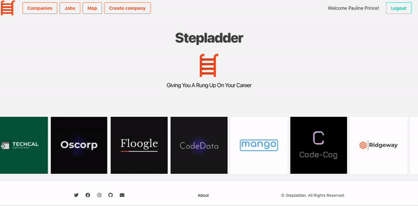
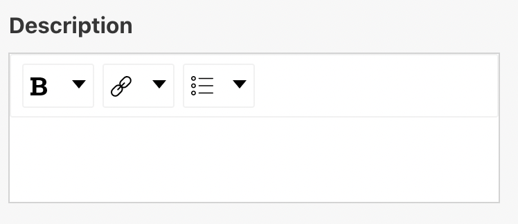

# Project 3 - Stepladder

## Overview

This was a one week project, working in a team of four to build and deploy a full-stack app.

You can see the deployed version here: [stepladderlw.herokuapp.com](https://stepladderlw.herokuapp.com/)



## The Brief

Build a full-stack MERN (Mongoose, Express, React, Node) app of the team's choice, then deploy it using Heroku.

## Technologies used

### Frontend:

* HTML5
* JavaScript (ES6)
* SASS
* Bulma
* React
* React-Router
* Webpack

### Backend:

* Node.js
* Express
* Mongoose
* MongoDB

### Testing:

* Chai
* Mocha
* Supertest

### External Libraries:
* Axios
* Mapbox
* draft.js
* draftToHTML
* react-rating
* react-wysiwyg
* bcrypt

### Other
* Github
* Git
* Heroku
* Mongo Atlas


## Approach

After we decided to do a jobs themed app, we planned what we wanted users to be able to do on the front-end. We decided that there should be two types of users with different permissions:

* Job seekers - should be able to browse companies and jobs, post comments on and rate companies, as well as apply for roles.
* Company admins - should be able create companies, and post/delete jobs to these companies.

The front-end was built using React.js and Bulma.
We also included a suite of tests, to ensure the webiste's functionally.

### The Back-end

The back-end is a CRUD API which we built as a team, using MongoDB, Mongoose, Node.js and Express, and a model, view, controller (MVC) structure to create end points. We have models for a user and a company, with views and controllers for these.

**Models**

*User model*

The user model was quite straight forward and, by using bcrypt, we were able to hash passwords, mongoose unique-validator and use mongoose-hidden to ensure security for users. We included a key:value pair to check to see if a user was company admin or a job seeker:

```
      isAdmin: { type: Boolean }

```


*Company model*

The company model was more complicated as it had individual jobs, comments and ratings 'living' on it.

```
const companySchema = new mongoose.Schema({
  company: { type: String, required: true, unique: true },
  website: { type: String, required: true },
  about: { type: String, required: true },
  industry: { type: [String], required: true },
  logo: { type: String, required: true },
  jobs: [jobSchema],
  user: { type: mongoose.Schema.ObjectId, ref: 'User', required: true },
  ratings: [ratingSchema],
  comments: [commentSchema]
})  
```
Planning our model in this way enabled us to fetch a company or job using the ids that MongoDB had created for them.

**Views and Controllers**

We made routes to enable users to:
* Register
* Login
* Leave Comments
* Post jobs
* Delete comments or posts

We did have to make a few changes as we progressed through the project. This included updating the location key, so it would work with react-select, and amending the rating key value from a string to an array, so we could collect and calculate mulitple ratings.


### The Front-end

We built the front-end using React.js and styled using Bulma, which a few adaptations! We used react-router to create pathways to different pages of the site in our app.js file. We tried to design the site so users wouldn't reach a dead-end, and that it would be intuitive for the user.

**Permissions/views**

There are 4 views of the front-end, which have differeing permissions and views:

1. Not registered/signing in
1. Signed in job seeker
1. Signed in company admin
1. Moderator

An example of the permissions is that a signed in job seeker can post a comment on a company, as well as delete their own comment however company admin cannot comment or delete a comment. The moderator can delete a comment. An unregistered user can only browse companies and jobs.

These permissions were acheieved by using logic on the front end and by checking that the user has a 'token', which is generated by the back-end when a user logs in. We were also able to extract the user type. This information gets saved in local storage during the user's session so it can be utlised throughout the site. It's removed when a user clicks 'logout' or when the token expires (12hrs after login).

**Forms**

As well as register and login, we had forms for posting a company and posting a job. We utilised some external libraries for this. I worked on the job posting form and wanted to give users the opportunity to have some formatting control over their post e.g. bolden titles and bullet point lists. For this, I used draft.js and react-wysiwyg. I also had to parse the information from draft.js and back into readable HTML and had to use two different libraries for this. It was a challenge but was amazing to see when the bullet points showed up! 

*Note: The current deployed version is not showing the bullet points. They are in the HTML but I expect there's a specifity issue with the CSS that I need to fix.*

*Example of draft.js/react-wysiwyg editor with formating options removed:*




**Other features**

* The homepage has a carousel, built using react-slick and is populated with company images, updating automatically when new companies are added.
* You can rate a company, and see the rating live update. This is stored as an array of ratings on the back-end and is calculated on the front-end.
* Users can click the apply button on the job posting page where a modal pops up and a documents can be added. Currently though, this isn't linked to anything!


## Conclusion

### Wins
* We built a fully tested app from scratch!
* We worked really well as a team, communicating well, debugging and helping when we came up against any blocks.

### Improvements
* I will be going back to check out the CSS issues that are preventing styles on job post pages from showing.
* With more time, we could have added more of an application process.
* We need to consider local storage and different browsers usage of it - to prevent users facing issues.
* We had planned to add a user profile but ran out of time for this.

### Accessibility
I've run lighthouse and axe-core in the browser, which has picked up some issues we need to fix. I will be going through and auditing this for accessibility issues.

